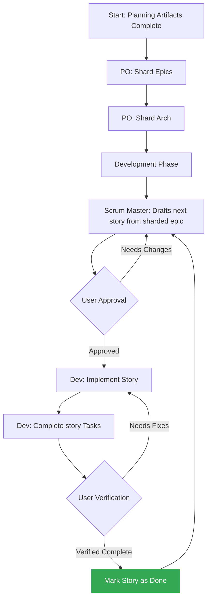

User Guide

This comprehensive guide will help you understand and effectively use the UNI-METHOD framework for AI-assisted software development.

## Table of Contents

1. [Understanding UNI](#understanding-uni)
2. [Getting Started](#getting-started)
3. [Agent System](#agent-system)
4. [Document Creation Best Practices](#document-creation-best-practices)
5. [Development Workflow](#development-workflow)

## Understanding UNI

### What is UNI-METHOD?

UNI-METHOD (Breakthrough Method of Agile AI-Driven Development) is an AI agent orchestration framework that provides specialized AI agents for every role in a complete Agile development team. Unlike generic AI assistants, each UNI agent has deep expertise in their specific domain and can collaborate to deliver complete software projects.

### Core Principles

1. **Specialized Expertise**: Each agent focuses on a specific role (PM, Architect, Developer, QA, etc.)
2. **True Agile Workflow**: Follows real Agile methodologies with proper story management
3. **Self-Contained Templates**: Documents embed both output and processing instructions
4. **Dynamic Dependencies**: Agents only load resources they need
5. **Platform Agnostic**: Works with any AI platform or IDE

### When to Use UNI

- **New Projects**: Complete end-to-end development
- **Existing Projects**: Feature additions and enhancements
- **Team Collaboration**: Multiple roles working together
- **Quality Assurance**: Structured testing and validation
- **Documentation**: Professional PRDs, architecture docs, user stories

## Getting Started

### Installation

#### Option 1: Gemini Gem or GPT Setup
In folder web-bundle, the text in agent-prompt.txt gets entered into the window of the main custom web agent instruction set. The other files in the build folder all need to be attached as files for the Gem or GPT.

**For Gemini:**
1. Create new Gem
2. Upload bundle as instruction file (agent-config.txt, checklists.txt, templates.txt, personas.txt, tasks.txt, data.txt)
3. Set system instructions for agent behavior (agent-prompt.txt)
4. Initialize with `/help` command

#### Option 2: IDE Setup (Cursor, GitHub Copilot, etc.)
**For Cursor:**
1. Enable Custom Agents Mode on your Cursor IDE
2. Copy custom prompt (sm.ide.md, dev.ide.md, etc.) into Cursor's custom agent settings

### First Steps

1. **Choose Your Environment**: Web UI or IDE
2. **Select Agent/Team**: Individual agent or full team
3. **Initialize Project**: Run `/help` to see capabilities
4. **Start Development**: Begin with planning or jump into coding

## Agent System

### Core Development Team
| Agent              | Role               | Primary Functions                       | When to Use                            |
|--------------------|--------------------| --------------------------------------- | -------------------------------------- |
| `analyst`          | Business Analyst   | Market research, requirements gathering | Project planning, competitive analysis |
| `pm`               | Product Manager    | PRD creation, feature prioritization    | Strategic planning, roadmaps           |
| `architect`        | Solution Architect | System design, technical architecture   | Complex systems, scalability planning  |
| `dev`              | Developer          | Code implementation, debugging          | All development tasks                  |
| `design-architect` | Designer           | UI/UX design, prototypes                | User experience, interface design      |
| `po`               | Product Owner      | Backlog management, story validation    | Story refinement, acceptance criteria  |
| `sm`               | Scrum Master       | Sprint planning, story creation         | Project management, workflow           |


### How Agents Work

#### Dependencies System

Each agent define its dependencies:

```yaml
dependencies:
  templates:
    - prd-tmpl.md
    - story-tmpl.md
  tasks:
    - create-prd.md
    - doc-sharding-task.md
  data:
    - uni-kb.md
```

**Key Points:**

- Agents only load resources they need (lean context)
- Dependencies are automatically resolved during bundling
- Resources are shared across agents to maintain consistency

## Document Creation Best Practices

### Web UI to IDE Workflow (Recommended for Gemini)

For cost efficiency, especially with Gemini:

1. **Create Large Documents in Web UI**: Use web bundles for PRD and architecture creation
2. **Copy to Project**: Save the final markdown output to your project's `docs/` folder
3. **Standard Naming**: Use `prd.md` and `architecture.md` for consistency
4. **Continue in IDE**: Use IDE agents for development tasks and smaller documents

### File Naming Conventions

**Required Names for Framework Integration:**

- `docs/prd.md` - Product Requirements Document
- `docs/architecture.md` - System Architecture Document

**Why These Names Matter:**

- Agents automatically reference these files during development
- Sharding tasks expect these specific filenames
- Workflow automation depends on standard naming

### IDE Document Creation

When working directly in IDEs:

- Agents should create documents in `docs/` folder automatically
- If agents name files differently (e.g., `product-requirements.md`), rename to `prd.md`
- Verify document location matches `docs/prd.md` and `docs/architecture.md`

### Templates and Document Creation

#### Understanding Templates

UNI templates are **self-contained and interactive** - they embed both the desired document output and the LLM instructions needed to work with users. This means no separate task is needed for most document creation.

#### Template Structure

Templates follow the specification:

- `{{placeholders}}` for variable substitution
- `[[LLM: instructions]]` for AI-only processing directives
- Conditional logic blocks
- Examples and guidance sections

#### Template Processing Flow

1. **User Request**: "Create a PRD"
2. **Agent Selection**: PM agent loads PRD template
3. **Interactive Processing**: Template guides conversation
4. **Content Generation**: AI follows embedded instructions
5. **User Refinement**: Built-in elicitation processes
6. **Final Output**: Complete, professional document

### Technical Preferences System

UNI includes a powerful personalization system through the `technical-preferences.md` file located in `docs/data/`.

#### What is technical-preferences.md?

This file allows you to define your preferred technologies, patterns, and standards once, then have agents automatically consider them across all projects. It acts as your personal technical profile that travels with your agent bundles.

#### What to Include

**Technology Stack Preferences:**

```markdown
## Preferred Technologies

### Frontend

- React with TypeScript
- Tailwind CSS for styling
- Next.js for full-stack applications

### Backend

- Node.js with Express
- PostgreSQL for relational data
- Redis for caching

### Deployment

- Vercel for frontend
- Railway for backend services
```

**Design Patterns & Standards:**

```markdown
## Code Standards

- Use functional programming patterns where possible
- Prefer composition over inheritance
- Always include comprehensive error handling
- Write tests for all business logic

## Architecture Preferences

- Microservices for complex applications
- RESTful APIs with OpenAPI documentation
- Event-driven architecture for real-time features
```

**External Services & APIs:**

```markdown
## Preferred External Services

- Auth0 for authentication
- Stripe for payments
- SendGrid for email
- Cloudinary for image processing

## APIs to Avoid

- Legacy SOAP services
- Services without proper documentation
```

#### How Agents Use This File

**Automatic Suggestions**: Agents will suggest your preferred technologies when appropriate for the project requirements.

**Informed Alternatives**: If your preferences don't fit the project, agents explain why and suggest alternatives.

**Consistency**: All agents reference the same preferences, ensuring consistent recommendations across planning and development.

#### Building Your Preferences Over Time

**Learning and Evolution**: As you work on projects, add discoveries to your preferences file:

#### Lessons Learned

- Avoid using Library X for large datasets (performance issues)
- Pattern Y works well for real-time features
- Service Z has excellent documentation and support

#### Future Exploration

- Want to try Framework A on next appropriate project
- Interested in Pattern B for microservices
- Consider Service C for better performance

#### Using with Web Bundles

When creating custom web bundles or uploading to AI platforms, include your `technical-preferences.md` content to ensure agents have your preferences from the start of any conversation.


## Development Workflow

### The Planning Workflow (Web UI)

Before development begins, UNI follows a structured planning workflow that's ideally done in web UI for cost efficiency:

```mermaid
graph TD
    A["Start: Project Idea"] --> B{"Optional: Analyst Brainstorming"}
    B -->|Yes| C["Analyst: Market Research & Analysis"]
    B -->|No| D["Create Project Brief"]
    C --> D["Analyst: Create Project Brief"]
    D --> E["PM: Create PRD from Brief"]
    E --> E1["Design Architect: Create UI/UX spec from PRD"]
    E1 --> E2["Architect: Create Architecture from PRD, UI/UX"]
    E2 --> F["Design Architect: Create Frontend Architect from UI/UX, Architecture"]
    F --> G["PO: Run Master Checklist"]
    G --> H{"Documents Aligned?"}
    H -->|Yes| I["Planning Complete"]
    H -->|No| J["PO: Update Epics & Stories"]
    J --> K["Update PRD/Architecture as needed"]
    K --> G
    I --> L["📁 Switch to IDE"]
    L --> M["PO: Shard Documents"]
    M --> N["Ready for SM/Dev Cycle"]

    style I fill:#34a853,color:#fff
    style G fill:#f9ab00,color:#fff
    style L fill:#1a73e8,color:#fff
    style N fill:#34a853,color:#fff
```



#### Web UI to IDE Transition

**Critical Transition Point**: Once the PO confirms document alignment, you must switch from web UI to IDE to begin the development workflow:

1. **Copy Documents to Project**: Ensure `docs/prd.md` and `docs/architecture.md` are in your project
2. **Switch to IDE**: Open your project in your preferred IDE (Cursor, Claude Code, Windsurf)
3. **Document Sharding**: Use PO agent to shard large documents into manageable pieces
4. **Begin Development**: Start the SM/Dev cycle for implementation

### The Core Development Cycle (IDE)

Once planning is complete and documents are sharded, UNI follows a structured development workflow:



### Workflow Phases

#### 1. Planning Phase

- **Analyst**: Market research, competitive analysis
- **PM**: Create PRD, define features
- **Architect**: System design, technical architecture
- **UX Expert**: User experience design

#### 2. Preparation Phase

- **PO**: Shard epics into manageable stories
- **PO**: Shard architecture into implementation tasks
- **SM**: Prepare initial story backlog

#### 3. Development Phase (Cyclical)

- **SM**: Draft next story from sharded epic
- **User**: Review and approve story
- **Dev**: Implement all story tasks
- **User**: Verify implementation
- **Repeat**: Until all stories complete

#### 4. Quality Assurance

- **QA**: Test planning and execution
- **Dev**: Bug fixes and refinements
- **PO**: Acceptance criteria validation